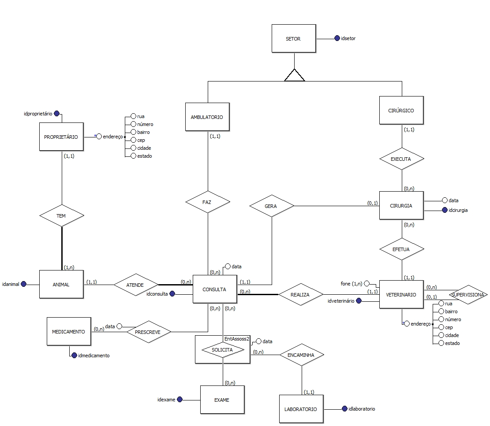

# Projeto da disciplina de Banco de Dados I do Curso Superior de Tecnologia em Sistemas para Internet do IFPB campus João Pessoa

## O objetivo deste projeto é desenvolver um baco de dados relacional de uma clínica veterinária fictícia

* Introdução: Descrição da finalidade do banco de dados. A introdução contém as informações da realidade a ser modelada (minimundo) com a descrição detalhada das regras de negócio e a definição do escopo do projeto.
* Esquema Conceitual: Apresenta o diagrama E-R contendo as cardinalidades máxima e mínima de cada relacionamento. Foi utilizada a notação de Peter Chen com o brModelo.
* Esquema Lógico: Apresenta o diagrama relacional normalizado contendo as cardinalidades máxima e mínima de cada relacionamento. Foi Utilizada a notação crow’s foot (IE) com o MySQL Workbench.
* Dicionário de Dados: Descrição do dicionário de dados do sistema.
* Script SQL: Foi utilizado o Microsoft SQL Server.

